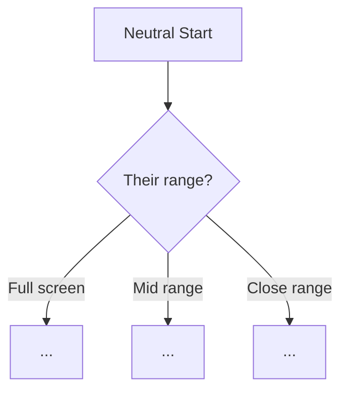
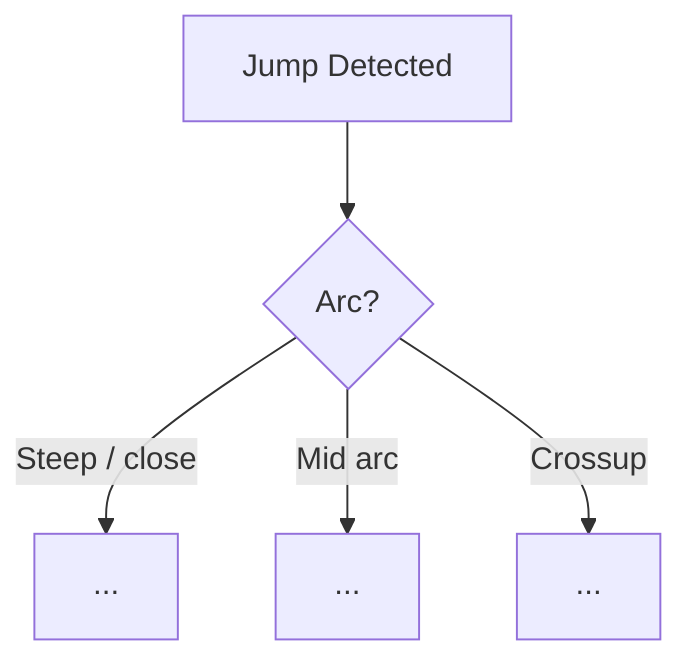
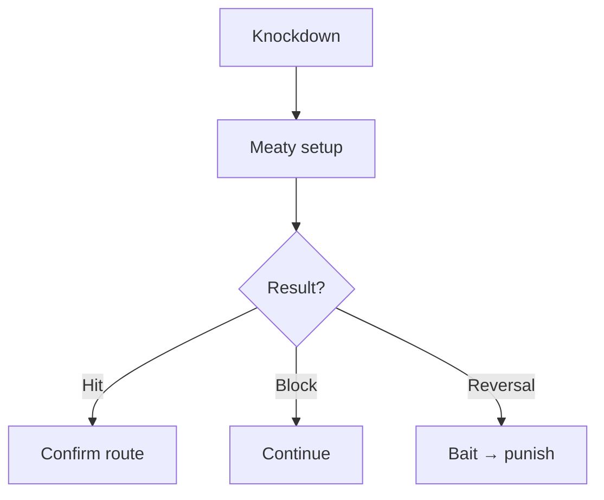
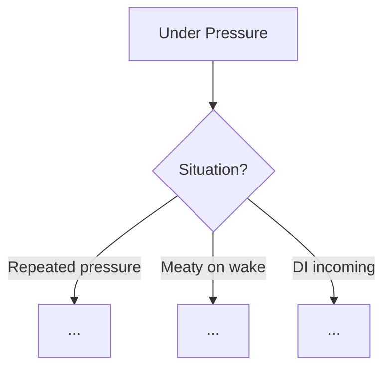

# Ryu Gameplan — [Version Title]

## Win Conditions

1. **[Primary]** — description
2. **[Secondary]** — description
3. **[Tertiary]** — description

---

## Neutral Framework

### Range Map

| Range | Stance | Primary Tools |
|-------|--------|---------------|
| Full screen | | |
| Mid range | | |
| Close range | | |

### Neutral Decision Tree

### Anti-Air Branch

---

## Pressure Framework

---

## Defense Framework

---

## Drive Gauge Philosophy

| Gauge State | Decision |
|-------------|----------|
| ≥ 4 bars | |
| 2–4 bars | |
| < 2 bars | |
| Opponent burnout | |
| Self near burnout | |

---

## Non-Negotiables

- 
- 
- 

---

## Matchup Overrides

| Character | Phase | Override | Reason |
|-----------|-------|----------|--------|
| — | — | None | |

---

## Adaptation Log

| Date | Version | Change Summary |
|------|---------|----------------|
| YYYY-MM-DD | 1 | Initial |
