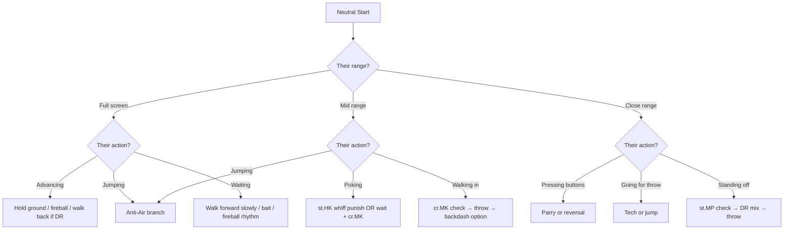
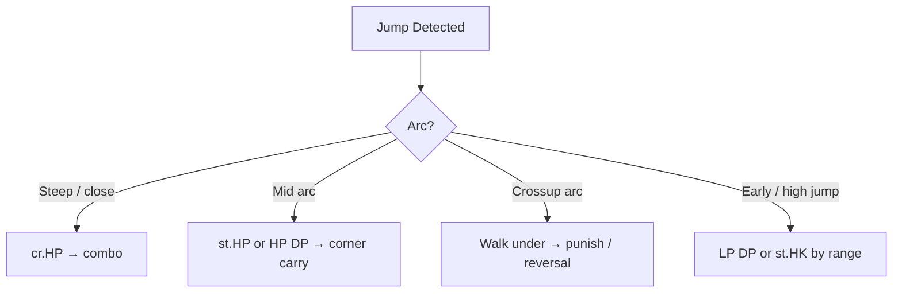
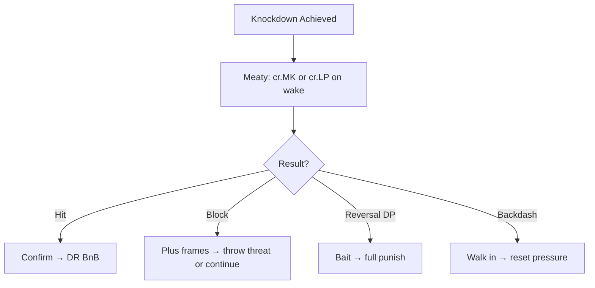
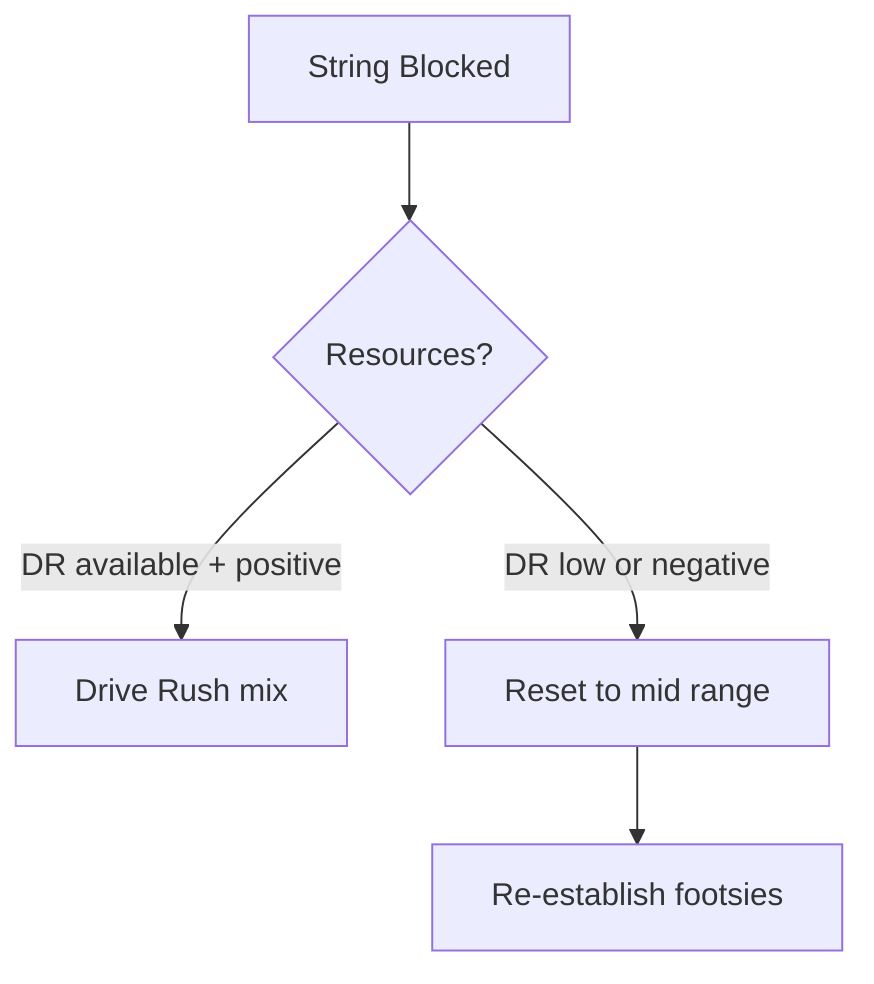
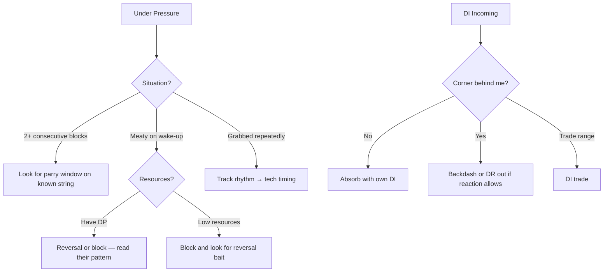

# Ryu Gameplan — Current

## Win Conditions

In priority order — pursue the highest-yield path available given the current round state.

1. **Whiff punish loop** — hold mid-range, bait a poke, convert with cr.MK or st.HK into Drive Rush BnB
2. **Anti-air control into corner carry** — shut down jump-in attempts, carry to corner, run oki
3. **Fireball rhythm into walk-in mix** — establish fireball cadence, walk in behind it, threaten throw or Drive Rush

---

## Neutral Framework

### Range Map

| Range | Stance | Primary Tools |
|-------|--------|---------------|
| Full screen | Patient / fireball | HP Hadouken, walk forward, react to DR |
| Mid range (footsies) | Controlled | cr.MK (poke), st.HK (counter poke), wait |
| Close range | Drive Rush or throw mix | st.MP check, cr.LP, throw, DR pressure |

### Neutral Decision Tree

### Anti-Air Branch

---

## Pressure Framework

### Post-Knockdown / Corner

### Blocked String

---

## Defense Framework

---

## Drive Gauge Philosophy

| Gauge State | Decision |
|-------------|----------|
| ≥ 4 bars | DR BnB available — play offensively |
| 2–4 bars | Limited DR — prefer whiff punish and anti-air routes |
| < 2 bars | **No offensive DR** — conserve; parry over DI |
| Opponent in burnout | Maximize pressure window; DR corner carry |
| Self near burnout | Parry over DI; no aggressive DR; escape cleanly |

---

## Non-Negotiables

These apply every session regardless of matchup or focus:

- Anti-air **every** jump unless it is a true crossup
- Check Drive Gauge **before** committing to DR or DI
- No re-queue after a ranked loss without writing the loss entry first

---

## Matchup Overrides

When playing a character listed here, deviations from the base gameplan are in effect.
In session frontmatter, set `gameplan_override: <character>` to flag it.

| Character | Phase | Override | Reason |
|-----------|-------|----------|--------|
| — | — | No active overrides | |

---

## Adaptation Log

Significant gameplan changes are recorded here. Full snapshots are in `gameplan/history/`.

| Date | Version | Change Summary |
|------|---------|----------------|
| 2026-04-05 |  | Seeded placeholder gameplan |
